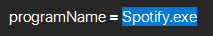
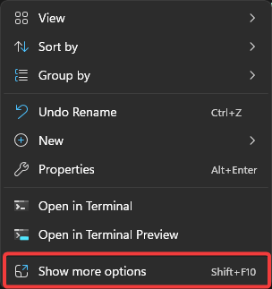
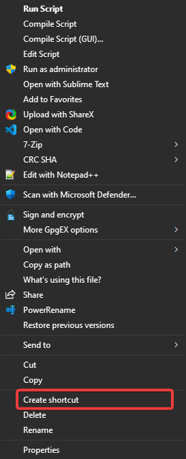
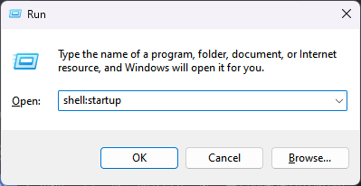
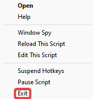

<h1><ins>F24 Audio Controls</ins></h1>

<h3>This script requires AutoHotkey</h3>

This AutoHotkey script allows you to use f24 keys to control the volume and play/pause the audio of media player like Spotify

* [Installation](#installation)
* [Changing the Application](#changing-the-application)
* [Starting the script on startup](#starting-the-script-on-startup)
* [Stopping the script](#stopping-the-script)

<h2>Installation</h2>

1. Download the latest version from this projects GitHub [Releases page](https://github.com/silas00301/f24_audio-controls/releases)
2. Move the file to the folder you want the script to run from.
3. If you do not have AutoHotkey installed already, download it from: https://www.autohotkey.com
4. Double click the file to run it, if this does not work: right click the file, click on `Open with...` and choose AutoHotkey.
5. Map the keys you want to use for the hotkeys to F20 for play/pause, F22 for volume down and F23 for volume up.

<h2 name="changing-the-application">Changing the Application</h2>

1. If the script is already running: [Stopping the script](#Stopping-the-script-on-startup)
2. Right click the .ahk file
3. Click on `Open with...`
4. Choose a text editor like Notepad
5. Replace Spotify.exe with the name of you desired application
  
6. Press `Ctrl + S` to save the changes you made to the file.

<h2>Starting the script on startup</h2>

1. Open the location of your script
2. Right click the .ahk file
3. Click on `Show more options`
  
4. Click on `Create shortcut`
  
5. Left click the Shortcut
6. Press `Ctrl + X`
7. Press `Win + R`
8. Enter `shell:startup` into the text field
  
9. Press `Ctrl + V`

<h2>Stopping the script</h2>

1. Click on the Up Arrow on your taskbar
  
2. Right click the AutoHotkey icon
  
3. Click on Exit
 
